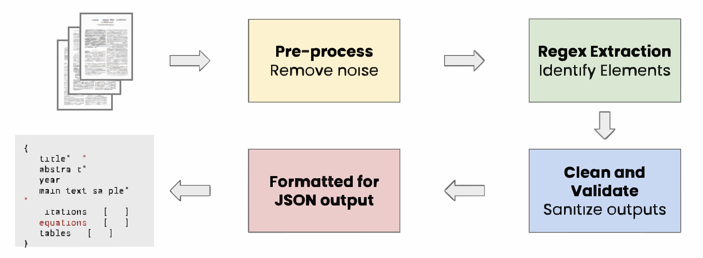
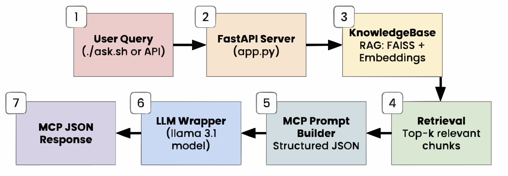

# Scientific Paper Metadata Extraction

This repository demonstrates two complementary approaches for extracting structured data from scientific LaTeX papers — starting from a simple regex-based parser and scaling up to an AI-powered RAG (Retrieval-Augmented Generation) system.

---

## Project Overview

| Component | Description | Strength |
|----------|------------|----------|
| baseline_regex/ | A lightweight, dependency-free parser that uses regular expressions to extract metadata from `.tex` papers. | Fast, simple, deterministic |
| ai_agent_rag/ | A semantic metadata extraction pipeline built with RAG, embeddings, vector search, and an LLM backend. | Flexible, context-aware, robust |

---

## 1. Baseline Regex Parser (`baseline_regex/`)

### Overview
The baseline parser is a simple, deterministic approach that uses Python’s `re` module to extract key sections from LaTeX source files.

It is ideal for:
- Quick metadata extraction when structure is predictable  
- Batch processing large volumes of `.tex` files  
- Serving as a pre-processing step for more advanced NLP pipelines

### What It Extracts
- Title (`\title{...}`)
- Abstract (`\begin{abstract}...\end{abstract}`)
- Year of publication (e.g., `2020`)
- Main text sample (first and last 500 chars)
- Citations (`\cite`, `\citep`, `\citet`, etc.)
- Equations (from `\begin{equation}` or `\[...\]`)
- First table (from `\begin{table}...\end{table}`)

### Pipeline
1. Pre-processing – Read `.tex` file and load content  
2. Regex Extraction – Identify LaTeX patterns using regular expressions  
3. Post-processing – Whitespace normalization, deduplication, trimming, and sampling  
4. Output – Save structured JSON to `output/`

---

### Usage
```bash
cd baseline_regex
python3 extract_features.py
```

---

### Regex System Architecture

<div align="center">
  
</div>

---

## 1. Intelligent RAG Querying App (`ai_agent_rag/`)

### Overview

This project is a small Retrieval-Augmented Generation (RAG) system designed to help a user query and ask questions about relevant LaTeX-written scientific papers. It pulls from predefined documentation (found in input), finds the most relevant context, and returns a JSON response with an answer and references.

Everything runs in Docker Compose to ensure an easy setup:

- FastAPI serves the Knowledge Assistant API

- Ollama runs the language model locally (default: llama3.1:latest)

- A single docker compose up brings the whole system online

### Tech Stack

- **FastAPI** - lightweight framework for serving the Knowledge Assistant API
- **SentenceTransformers + FAISS** - embedding documentation and retrieving document chunks
- **Ollama** - LLM backend for generating structured MCP-compliant answers
- **Pydantic** - schema validation for request and response models
- **Docker Compose** - setup for reproducible local deployment

---

### Usage

1. **Clone the repository**

2. **Build and start the containers**

    Make sure Docker is running, then run: 
    ```bash
    docker compose up --build
    ```

    This starts: 
    - FastAPI server (`listening on http://127.0.0.1:8000`)

    - Ollama LLM backend (`port 11434`)

3. **Pull the model (only needed for the first run)**

    In another terminal: 
    ```bash
    docker compose exec ollama ollama pull llama3.1:latest
    ```

4. **Ask a question**

   Make the provided helper script executable:  
   ```bash
   chmod +x ./ask.sh
   ```

    Using the provided helper script: 
    ```bash
    ./ask.sh
    ```

--- 

### AI System Architecture

<div align="center">
  
</div>